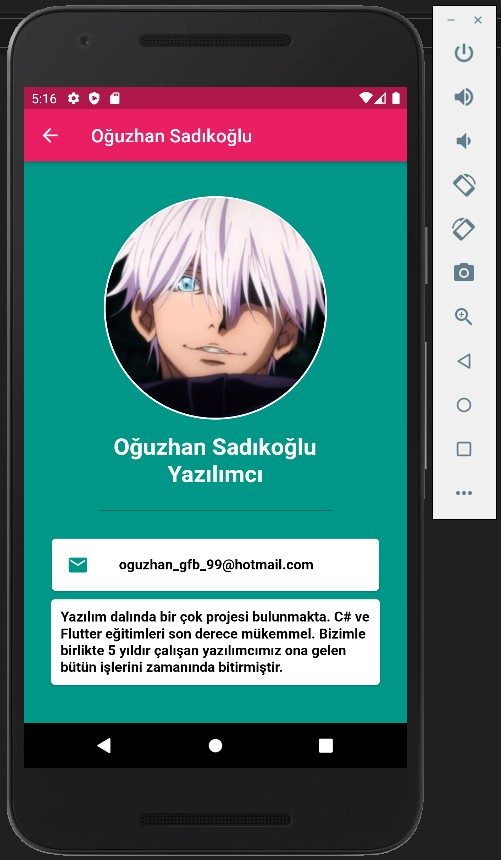
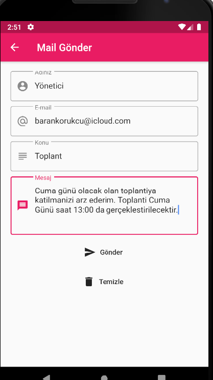
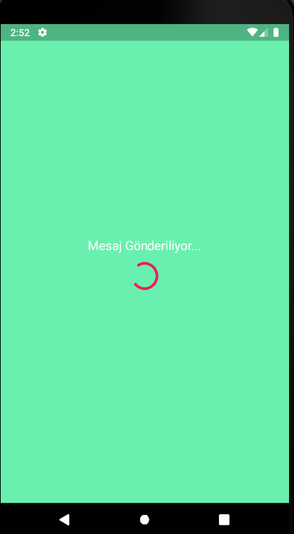
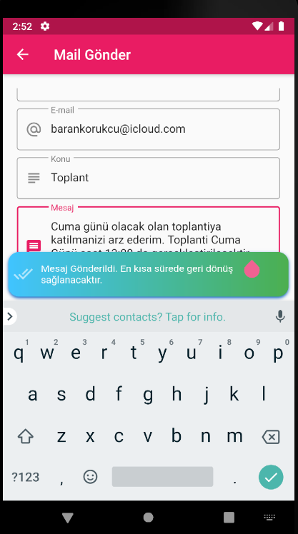

# Flutter Dart Şirket Rehber Uygulaması

Bu uygulamam da bir firmanın rehberini tutmak istedim. Firma Rehberi olan uygulamam da kişilerin departmanı, hakkında kısmı, isim soy isim ve
ulaşım bilgilerinin barındığı bölümler mevcuttur. Bu uygulama da Firma da çalışan bütün herkesi JSON veri olarak internetten çekiyorum.
Uygulamam da Yükleniyor ekranları dışında 3 tane sayfa bulunmaktadır.
Fotoğrafları Hızlı Resime yükleyip JSON verilerine o linkleri girdim.
JSON verisinde kişilerin adı soyadı, mail adresleri, Hakkında yazısı ve de Departmanı bulunmakta.
Mail Gönderme sayfasında kime tıkladıysak onun maili geliyor ve İsmimizi-konumuzu-mesajımızı yazdıktan sonra Gönder butonuna tıklandıktan sonra
o kullanıcıya şirket tarafından mail yollanılıyor.
Bütün kodların açıklama satırları bulunmaktadır ****

Uygulamanın tam hali için;

### Benimle İletişime Geç

&nbsp;&nbsp;

&nbsp;&nbsp;

# Tasarım 

&nbsp;&nbsp;

&nbsp;&nbsp;

&nbsp;&nbsp;

&nbsp;&nbsp;

&nbsp;&nbsp;

&nbsp;&nbsp;

